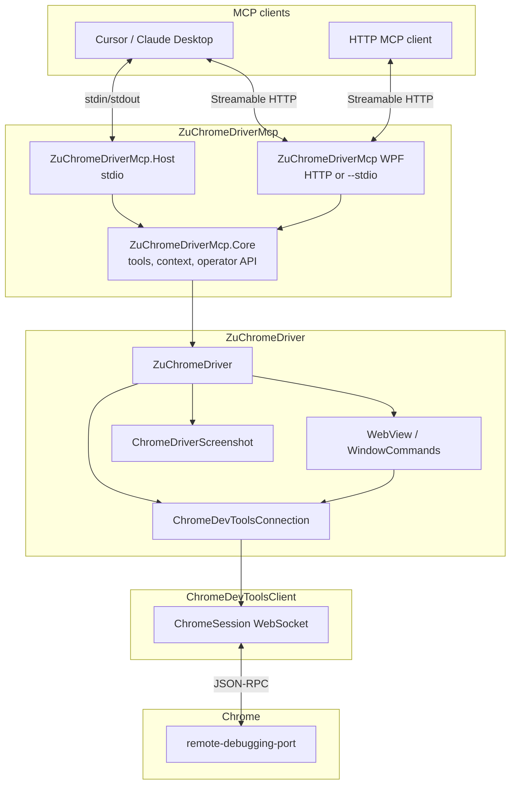
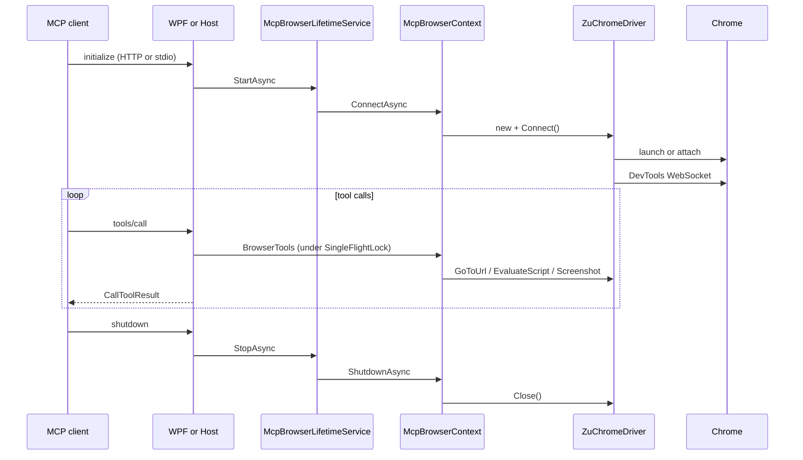

# Архитектура ZuChromeDriverMcp

Документ описывает **MCP-слой** репозитория ZuChromeDriverMcp: как он связан с [ZuChromeDriver](https://github.com/ToCSharp/ZuChromeDriver) и что остаётся только в protocol/mapping.

Базовый стек драйвера (CDP WebSocket, Connect, WebView, ElementCommands) — в репозитории [ZuChromeDriver](https://github.com/ToCSharp/ZuChromeDriver).

---

## Назначение

**ZuChromeDriverMcp** даёт LLM-агентам инструменты для управления Chrome через MCP. Два хоста поверх общего Core: **WPF** (основной — GUI, настройки, HTTP MCP) и **Host** (второй — консольный stdio). Реализация **не** запускает отдельный CDP-клиент и **не** использует PuppeteerSharp: один экземпляр **`ZuChromeDriver`** обслуживает все tool-вызовы.

Референс API и категорий tools — [chrome-devtools-mcp](https://github.com/ChromeDevTools/chrome-devtools-mcp) (Node). Lighthouse и Performance — в [TODO](README.md#todo).

---

## Обзор слоёв



### Границы ответственности

| Слой | Отвечает за | Не отвечает за |
|------|-------------|----------------|
| **WPF** | **Основной хост** — HTTP MCP (GUI) или `--stdio`; настройки, профили, MVVM UI, рантайм-панель | Дублирование tool-логики в UI |
| **Host** | Второй хост — stdio transport, DI, auto-connect Chrome, логи в stderr | CDP, DOM, клики |
| **Core** | MCP tools, mutex, `McpOperatorService`, `McpRuntimeMonitor`, конфиг | Запуск процесса WPF/Host |
| **ZuChromeDriver** | Chrome lifecycle, CDP-сессия, WebDriver-семантика | MCP protocol |
| **ChromeDevToolsClient** | WebSocket, JSON-RPC, домены CDP | Выбор вкладки, запуск Chrome |

---

## Проекты решения

```
ZuChromeDriverMcp/
├── ZuChromeDriverMcp/               # net10.0-windows WPF — основной MCP-хост
├── ZuChromeDriverMcp.Core/          # net10.0 classlib — tools + browser context
├── ZuChromeDriverMcp.Host/          # net10.0 exe — второй MCP-хост (stdio)
└── ZuChromeDriverMcp.slnx
```

| Проект | Зависимости | Роль |
|--------|-------------|------|
| **WPF** | Core, `ModelContextProtocol.AspNetCore`, `CommunityToolkit.Mvvm` | HTTP MCP + GUI; `--stdio` headless; MVVM operator UI |
| **Core** | ZuChromeDriver *(NuGet)*, `ModelContextProtocol` | Tools, `McpBrowserContext`, `McpOperatorService`, `McpRuntimeMonitor` |
| **Host** | Core, `ModelContextProtocol`, `Microsoft.Extensions.Hosting` | stdio MCP, `McpBrowserLifetimeService`, `AddZuChromeDriverMcpTools` |

Отдельный **`ZuChromeDriverMcp.Chrome`** не планируется: CDP и профили — в **`ZuChromeDriver/ChromeDevTools/`**.

---

## Жизненный цикл процесса



1. **`McpBrowserLifetimeService`** при старте вызывает **`McpBrowserContext.ConnectAsync()`** → **`ZuChromeDriver.Connect()`**.
2. MCP server принимает tool-вызовы через HTTP (WPF GUI) или stdio (WPF `--stdio` / Host).
3. При остановке приложения вызывается **`Close()`** — закрытие вкладок / процесса Chrome (режим attach — см. конфиг).

---

## Компоненты Core

### `McpHostOptions` / конфигурация

Файл: `ZuChromeDriverMcp.Core/Configuration/McpHostOptions.cs`

- Секция **`ZuChromeDriverMcp`** в configuration (JSON / env).
- Env **`ZU_CHROME_DRIVER_MCP_*`** с приоритетом поверх JSON.
- Метод **`ToChromeDriverConfig()`** — маппинг в **`ChromeDriverConfig`** (порт, headless, профиль, attach, **FrameTracker** / **DomTracker** / browser log).
- **`EnableDevToolsCollectorOnConnect`** — подписка **`McpDevToolsCollector`** на Network/Runtime (env `ENABLE_DEVTOOLS_COLLECTOR`, по умолчанию false).
- **`McpCategoryOptions`** — флаги категорий tools; CLI `--category-*`, env `ZU_CHROME_DRIVER_MCP_CATEGORY_*`.
- **`McpToolGate`** — при отключённой категории tool возвращает actionable ошибку.

### `McpBrowserContext`

Файл: `ZuChromeDriverMcp.Core/Browser/McpBrowserContext.cs`

- Держит **один** **`ZuChromeDriver`** на процесс MCP.
- **`ConnectAsync`** — Connect; при **`EnableDevToolsCollectorOnConnect`** — подписка **`McpDevToolsCollector`** на Network/Runtime.
- **`EnsureCollectorForCurrentSessionAsync`** — переподписка collector после смены CDP-сессии (connect / `select_page` / `new_page`).
- **`SnapshotStore`**, **`Collector`** — общее состояние для tools.
- **`SaveTemporaryFileAsync`** — PNG скриншотов в каталог артефактов (`McpHostOptions.GetArtifactsDirectory()`): по умолчанию `{exe_dir}/Temp/zu-chrome-driver-mcp\`, опционально `%TEMP%\zu-chrome-driver-mcp\` (`ARTIFACTS_LOCATION=system-temp`).

### `McpPageService`

- Список вкладок: HTTP **`GET /json`** (`McpChromeJsonTarget`, поле `url`).
- **`pageId`**: 1-based индекс в списке page targets (как в chrome-devtools-mcp).
- **`select_page`**: **`SwitchDevToolsToTarget`** + опционально **`Target.activateTarget`**.
- **`new_page`**: **`Target.createTarget`** → switch.
- **`close_page`**: switch при необходимости → **`Target.closeTarget`**.

### Snapshot (uid)

| Компонент | Роль |
|-----------|------|
| **`McpSnapshotService`** | `Accessibility.getFullAXTree`, построение дерева, uid |
| **`McpSnapshotStore`** | Текущий snapshot для резолва uid |
| **`McpSnapshotFormatter`** | Текстовый вывод для агента (`uid=… role "name"`) |

### `McpElementActions`

- **uid**: `DOM.resolveNode(backendDOMNodeId)` → `Runtime.callFunctionOn` (`click` / `value`).
- **selector**: `WindowCommands.FindElement("css selector", …)` → **`ElementCommands`**.

### `McpDevToolsCollector`

- Включается только при **`EnableDevToolsCollectorOnConnect`** (не путать с **`CATEGORY_NETWORK`** / **`CATEGORY_DEBUGGING`** — те лишь скрывают tools).
- Буферы сети и консоли с момента последней навигации (`navigate`, `select_page`, `new_page`).
- События: **`Network.requestWillBeSent`**, **`Runtime.consoleAPICalled`**; **`ResetSubscription`** сбрасывает флаг подписки при disconnect / смене вкладки.
- Событие **`Changed`** и счётчики **`NetworkCount`** / **`ConsoleCount`** — для WPF runtime panel.

### `McpOperatorService` / `McpRuntimeMonitor`

- **`McpOperatorService`** — Connect/Disconnect, Navigate, Screenshot, List/Select pages (обёртки над Core, `SingleFlightLock`).
- **`McpRuntimeMonitor`** — `McpRuntimeSnapshot`, подписка на collector/context, периодический refresh активной вкладки.
- WPF ViewModels биндятся к snapshot; не вызывают CDP напрямую.

### `McpHeapSnapshotService`

- **`HeapProfiler.takeHeapSnapshot`** + события **`addHeapSnapshotChunk`** → файл `.heapsnapshot`.

### `McpArtifactPaths`

- Разрешение `filePath` (абсолютный / относительный / каталог артефактов из `McpHostOptions`).

### `SingleFlightLock`

Файл: `ZuChromeDriverMcp.Core/Concurrency/SingleFlightLock.cs`

- `SemaphoreSlim(1,1)` — все tools выполняются **строго по одному** (аналог mutex в chrome-devtools-mcp `ToolHandler`).
- Исключает гонки при общей CDP-сессии и одной вкладке.

### `McpResponse`

Файл: `ZuChromeDriverMcp.Core/Responses/McpResponse.cs`

- Накопление короткого текста для агента.
- **`ToCallToolResult()`** → `CallToolResult` с **`IsError`** и `TextContentBlock`.
- Ошибки — actionable message (текст исключения или валидации).

### MCP tools (классы)

| Класс | Tools |
|-------|-------|
| **`BrowserTools`** | `navigate`, `evaluate`, `screenshot` |
| **`PageTools`** | `list_pages`, `select_page`, `new_page`, `close_page` |
| **`SnapshotTools`** | `take_snapshot` |
| **`InputTools`** | `click`, `fill` |
| **`CollectorTools`** | `list_network_requests`, `list_console_messages` |
| **`MemoryTools`** | `take_heapsnapshot` |

Атрибуты **`[McpServerToolType]`** / **`[McpServerTool]`** — discovery через **`AddZuChromeDriverMcpTools()`** (`McpServerServiceCollectionExtensions.cs`).

---

## WPF (основной хост)

| Режим | Запуск | Transport |
|-------|--------|-----------|
| GUI | `dotnet run --project ZuChromeDriverMcp` | Streamable HTTP на `127.0.0.1:{McpHttpPort}{McpHttpPath}` |
| Headless | `... -- --stdio` | stdio (как Host) |

- **`WpfAppBootstrap`**: dual-mode entry; GUI — Kestrel в фоне + WPF `Application.Run`.
- **`McpBrowserShutdownService`**: `ShutdownAsync` при закрытии приложения.
- Chrome подключается при старте; в GUI — вкладки настроек, профилей, управления и рантайм-панель.
- MVVM: **CommunityToolkit.Mvvm** (`ObservableObject`, `[ObservableProperty]`, `[RelayCommand]`).
- Подключение в Cursor: `http://127.0.0.1:5100/mcp` (см. [README](README.md)).

---

## Host (stdio) — второй вариант

Файл: `ZuChromeDriverMcp.Host/Program.cs`

```csharp
builder.Services.AddZuChromeDriverMcpCore(options);
builder.Services.AddHostedService<McpBrowserLifetimeService>();
builder.Services
    .AddMcpServer()
    .WithStdioServerTransport()
    .AddZuChromeDriverMcpTools();
```

Консольный stdio-хост без UI — минимальный вариант для скриптов и CI. В stdout только MCP JSON-RPC; логи — только stderr.

---

## Две «session»

В коде ZuChromeDriver coexist два понятия (не путать в MCP-доках и tools):

| Имя | Тип | Уровень |
|-----|-----|---------|
| **Session** | `Zu.Chrome.DriverCore.Session` | WebDriver: frames, timeouts, sticky modifiers |
| **ChromeSession** | `Zu.ChromeDevToolsClient` WebSocket | CDP JSON-RPC, домены Page/Runtime/DOM |

MCP-слой работает через **`ZuChromeDriver`**, не открывая второй WebSocket.

---

## Сопоставление с chrome-devtools-mcp

| chrome-devtools-mcp | ZuChromeDriverMcp (сейчас) |
|---------------------|------------------------------|
| `@modelcontextprotocol/sdk` + stdio | NuGet **`ModelContextProtocol`** 1.3 |
| `McpContext` + selected page | **`McpBrowserContext`** + одна активная вкладка |
| `ToolHandler` + mutex | **`SingleFlightLock`** + **`BrowserTools`** |
| `McpResponse` | **`McpResponse`** → **`CallToolResult`** |
| navigate / evaluate / screenshot | ✅ |
| list_pages, snapshot, click/fill, collectors | ✅ |
| take_heapsnapshot | ✅ (CDP) |
| performance trace, lighthouse_audit, performance_analyze_insight | TODO (см. [README](README.md#todo)) |

---

## Что не входит в MCP-слой

- Генерация и поддержка CDP-типов (**ChromeDevToolsClientGenerator**).
- Атомы Selenium-style (**`atoms.cs`**, **`ElementCommands`**) — вызываются из **`InputTools`** (selector); uid — через CDP resolve + callFunctionOn.
- Парсинг heap snapshot / experimental memory tools — только в Node (не портировано).
- Daemon + named pipe — не планируется.

---

## Расширение (ориентиры)

| Задача | Куда добавлять |
|--------|----------------|
| Новый MCP tool | `ZuChromeDriverMcp.Core/Tools/` + `AddZuChromeDriverMcpTools()` |
| Snapshot uid | `ZuChromeDriverMcp.Core/Snapshot/` |
| Network/console collectors | `McpDevToolsCollector` |
| Переключение вкладок | `McpPageService` |
| Изменение Connect/iframe | **ZuChromeDriver** + флаги **`ChromeDriverConfig`** |

---

## Связанные документы

- [README.md](README.md) — быстрый старт
- [ZuChromeDriver](https://github.com/ToCSharp/ZuChromeDriver) — драйвер CDP и WebDriver-фасад
