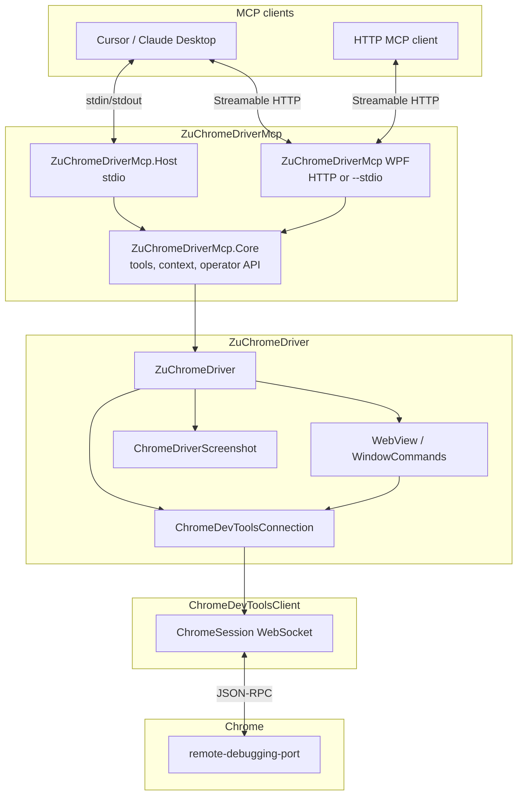
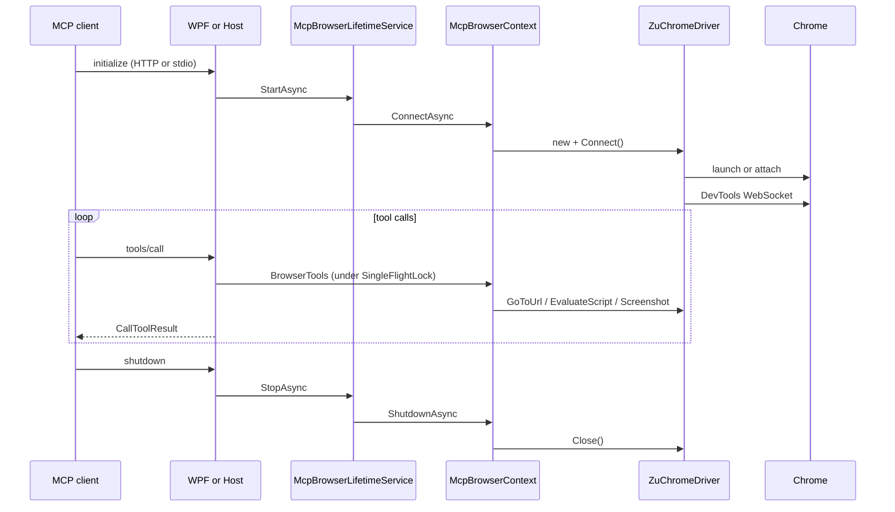

# ZuChromeDriverMcp Architecture

This document describes the **MCP layer** of the ZuChromeDriverMcp repository: how it connects to [ZuChromeDriver](https://github.com/ZuChromeDriver/ZuChromeDriver) and what remains only in protocol/mapping.

The base driver stack (CDP WebSocket, Connect, WebView, ElementCommands) lives in the [ZuChromeDriver](https://github.com/ZuChromeDriver/ZuChromeDriver) repository.

---

## Purpose

**ZuChromeDriverMcp** gives LLM agents tools to control Chrome via MCP. Two hosts on top of shared Core: **WPF** (primary — GUI, settings, HTTP MCP) and **Host** (secondary — console stdio). The implementation does **not** start a separate CDP client and does **not** use PuppeteerSharp: a single **`ZuChromeDriver`** instance serves all tool calls.

API and tool category reference — [chrome-devtools-mcp](https://github.com/ChromeDevTools/chrome-devtools-mcp) (Node). Lighthouse and Performance — in [TODO](README.md#todo).

---

## Layer Overview



### Responsibility Boundaries

| Layer | Responsible for | Not responsible for |
|-------|-----------------|---------------------|
| **WPF** | **Primary host** — HTTP MCP (GUI) or `--stdio`; settings, profiles, MVVM UI, runtime panel | Duplicating tool logic in the UI |
| **Host** | Secondary host — stdio transport, DI, auto-connect Chrome, logs to stderr | CDP, DOM, clicks |
| **Core** | MCP tools, mutex, `McpOperatorService`, `McpRuntimeMonitor`, config | Starting WPF/Host process |
| **ZuChromeDriver** | Chrome lifecycle, CDP session, WebDriver semantics | MCP protocol |
| **ChromeDevToolsClient** | WebSocket, JSON-RPC, CDP domains | Tab selection, Chrome launch |

---

## Solution Projects

```
ZuChromeDriverMcp/
├── ZuChromeDriverMcp/               # net10.0-windows WPF — primary MCP host
├── ZuChromeDriverMcp.Core/          # net10.0 classlib — tools + browser context
├── ZuChromeDriverMcp.Host/          # net10.0 exe — secondary MCP host (stdio)
└── ZuChromeDriverMcp.slnx
```

| Project | Dependencies | Role |
|---------|--------------|------|
| **WPF** | Core, `ModelContextProtocol.AspNetCore`, `CommunityToolkit.Mvvm` | HTTP MCP + GUI; `--stdio` headless; MVVM operator UI |
| **Core** | ZuChromeDriver *(NuGet)*, `ModelContextProtocol` | Tools, `McpBrowserContext`, `McpOperatorService`, `McpRuntimeMonitor` |
| **Host** | Core, `ModelContextProtocol`, `Microsoft.Extensions.Hosting` | stdio MCP, `McpBrowserLifetimeService`, `AddZuChromeDriverMcpTools` |

A separate **`ZuChromeDriverMcp.Chrome`** is not planned: CDP and profiles live in **`ZuChromeDriver/ChromeDevTools/`**.

---

## Process Lifecycle



1. **`McpBrowserLifetimeService`** calls **`McpBrowserContext.ConnectAsync()`** → **`ZuChromeDriver.Connect()`** on startup.
2. The MCP server accepts tool calls via HTTP (WPF GUI) or stdio (WPF `--stdio` / Host).
3. On application shutdown, **`Close()`** is called — closing tabs / Chrome process (attach mode — see config).

---

## Core Components

### `McpHostOptions` / Configuration

File: `ZuChromeDriverMcp.Core/Configuration/McpHostOptions.cs`

- Section **`ZuChromeDriverMcp`** in configuration (JSON / env).
- Env **`ZU_CHROME_DRIVER_MCP_*`** takes priority over JSON.
- Method **`ToChromeDriverConfig()`** — maps to **`ChromeDriverConfig`** (port, headless, profile, attach, **FrameTracker** / **DomTracker** / browser log).
- **`EnableDevToolsCollectorOnConnect`** — subscribes **`McpDevToolsCollector`** to Network/Runtime (env `ENABLE_DEVTOOLS_COLLECTOR`, default false).
- **`McpCategoryOptions`** — tool category flags; CLI `--category-*`, env `ZU_CHROME_DRIVER_MCP_CATEGORY_*`.
- **`McpToolGate`** — when a category is disabled, the tool returns an actionable error.

### `McpBrowserContext`

File: `ZuChromeDriverMcp.Core/Browser/McpBrowserContext.cs`

- Holds **one** **`ZuChromeDriver`** per MCP process.
- **`ConnectAsync`** — Connect; when **`EnableDevToolsCollectorOnConnect`** — subscribes **`McpDevToolsCollector`** to Network/Runtime.
- **`EnsureCollectorForCurrentSessionAsync`** — re-subscribes collector after CDP session change (connect / `select_page` / `new_page`).
- **`SnapshotStore`**, **`Collector`** — shared state for tools.
- **`SaveTemporaryFileAsync`** — PNG screenshots to artifacts directory (`McpHostOptions.GetArtifactsDirectory()`): default `{exe_dir}/Temp/zu-chrome-driver-mcp\`, optionally `%TEMP%\zu-chrome-driver-mcp\` (`ARTIFACTS_LOCATION=system-temp`).

### `McpPageService`

- Tab list: HTTP **`GET /json`** (`McpChromeJsonTarget`, `url` field).
- **`pageId`**: 1-based index in the page targets list (as in chrome-devtools-mcp).
- **`select_page`**: **`SwitchDevToolsToTarget`** + optional **`Target.activateTarget`**.
- **`new_page`**: **`Target.createTarget`** → switch.
- **`close_page`**: switch if needed → **`Target.closeTarget`**.

### Snapshot (uid)

| Component | Role |
|-----------|------|
| **`McpSnapshotService`** | `Accessibility.getFullAXTree`, tree building, uid |
| **`McpSnapshotStore`** | Current snapshot for uid resolution |
| **`McpSnapshotFormatter`** | Text output for the agent (`uid=… role "name"`) |

### `McpElementActions`

- **uid**: `DOM.resolveNode(backendDOMNodeId)` → `Runtime.callFunctionOn` (`click` / `value`).
- **selector**: `WindowCommands.FindElement("css selector", …)` → **`ElementCommands`**.

### `McpDevToolsCollector`

- Enabled only when **`EnableDevToolsCollectorOnConnect`** (not to be confused with **`CATEGORY_NETWORK`** / **`CATEGORY_DEBUGGING`** — those only hide tools).
- Network and console buffers since the last navigation (`navigate`, `select_page`, `new_page`).
- Events: **`Network.requestWillBeSent`**, **`Runtime.consoleAPICalled`**; **`ResetSubscription`** clears the subscription flag on disconnect / tab change.
- **`Changed`** event and **`NetworkCount`** / **`ConsoleCount`** counters — for WPF runtime panel.

### `McpOperatorService` / `McpRuntimeMonitor`

- **`McpOperatorService`** — Connect/Disconnect, Navigate, Screenshot, List/Select pages (wrappers over Core, `SingleFlightLock`).
- **`McpRuntimeMonitor`** — `McpRuntimeSnapshot`, subscription to collector/context, periodic refresh of active tab.
- WPF ViewModels bind to snapshot; do not call CDP directly.

### `McpHeapSnapshotService`

- **`HeapProfiler.takeHeapSnapshot`** + **`addHeapSnapshotChunk`** events → `.heapsnapshot` file.

### `McpArtifactPaths`

- Resolves `filePath` (absolute / relative / artifacts directory from `McpHostOptions`).

### `SingleFlightLock`

File: `ZuChromeDriverMcp.Core/Concurrency/SingleFlightLock.cs`

- `SemaphoreSlim(1,1)` — all tools run **strictly one at a time** (analog of mutex in chrome-devtools-mcp `ToolHandler`).
- Prevents races with a shared CDP session and single tab.

### `McpResponse`

File: `ZuChromeDriverMcp.Core/Responses/McpResponse.cs`

- Accumulates short text for the agent.
- **`ToCallToolResult()`** → `CallToolResult` with **`IsError`** and `TextContentBlock`.
- Errors — actionable message (exception or validation text).

### MCP Tools (Classes)

| Class | Tools |
|-------|-------|
| **`BrowserTools`** | `navigate`, `evaluate`, `screenshot` |
| **`PageTools`** | `list_pages`, `select_page`, `new_page`, `close_page` |
| **`SnapshotTools`** | `take_snapshot` |
| **`InputTools`** | `click`, `fill` |
| **`CollectorTools`** | `list_network_requests`, `list_console_messages` |
| **`MemoryTools`** | `take_heapsnapshot` |

Attributes **`[McpServerToolType]`** / **`[McpServerTool]`** — discovery via **`AddZuChromeDriverMcpTools()`** (`McpServerServiceCollectionExtensions.cs`).

---

## WPF (Primary Host)

| Mode | Launch | Transport |
|------|--------|-----------|
| GUI | `dotnet run --project ZuChromeDriverMcp` | Streamable HTTP on `127.0.0.1:{McpHttpPort}{McpHttpPath}` |
| Headless | `... -- --stdio` | stdio (like Host) |

- **`WpfAppBootstrap`**: dual-mode entry; GUI — Kestrel in background + WPF `Application.Run`.
- **`McpBrowserShutdownService`**: `ShutdownAsync` on application close.
- Chrome connects on startup; in GUI — settings, profiles, control, and runtime panel tabs.
- MVVM: **CommunityToolkit.Mvvm** (`ObservableObject`, `[ObservableProperty]`, `[RelayCommand]`).
- Cursor connection: `http://127.0.0.1:5100/mcp` (see [README](README.md)).

---

## Host (stdio) — Alternative

File: `ZuChromeDriverMcp.Host/Program.cs`

```csharp
builder.Services.AddZuChromeDriverMcpCore(options);
builder.Services.AddHostedService<McpBrowserLifetimeService>();
builder.Services
    .AddMcpServer()
    .WithStdioServerTransport()
    .AddZuChromeDriverMcpTools();
```

Console stdio host without UI — minimal option for scripts and CI. stdout is MCP JSON-RPC only; logs go to stderr only.

---

## Two "Sessions"

In ZuChromeDriver code, two concepts coexist (do not confuse in MCP docs and tools):

| Name | Type | Level |
|------|------|-------|
| **Session** | `Zu.Chrome.DriverCore.Session` | WebDriver: frames, timeouts, sticky modifiers |
| **ChromeSession** | `Zu.ChromeDevToolsClient` WebSocket | CDP JSON-RPC, Page/Runtime/DOM domains |

The MCP layer works through **`ZuChromeDriver`**, without opening a second WebSocket.

---

## Comparison with chrome-devtools-mcp

| chrome-devtools-mcp | ZuChromeDriverMcp (current) |
|---------------------|------------------------------|
| `@modelcontextprotocol/sdk` + stdio | NuGet **`ModelContextProtocol`** 1.3 |
| `McpContext` + selected page | **`McpBrowserContext`** + one active tab |
| `ToolHandler` + mutex | **`SingleFlightLock`** + **`BrowserTools`** |
| `McpResponse` | **`McpResponse`** → **`CallToolResult`** |
| navigate / evaluate / screenshot | ✅ |
| list_pages, snapshot, click/fill, collectors | ✅ |
| take_heapsnapshot | ✅ (CDP) |
| performance trace, lighthouse_audit, performance_analyze_insight | TODO (see [README](README.md#todo)) |

---

## What Is Not in the MCP Layer

- CDP type generation and maintenance (**ChromeDevToolsClientGenerator**).
- Selenium-style atoms (**`atoms.cs`**, **`ElementCommands`**) — called from **`InputTools`** (selector); uid — via CDP resolve + callFunctionOn.
- Heap snapshot parsing / experimental memory tools — Node only (not ported).
- Daemon + named pipe — not planned.

---

## Extension (Guidelines)

| Task | Where to add |
|------|--------------|
| New MCP tool | `ZuChromeDriverMcp.Core/Tools/` + `AddZuChromeDriverMcpTools()` |
| Snapshot uid | `ZuChromeDriverMcp.Core/Snapshot/` |
| Network/console collectors | `McpDevToolsCollector` |
| Tab switching | `McpPageService` |
| Connect/iframe changes | **ZuChromeDriver** + **`ChromeDriverConfig`** flags |

---

## Related Documents

- [README.md](README.md) — quick start
- [ZuChromeDriver](https://github.com/ZuChromeDriver/ZuChromeDriver) — CDP driver and WebDriver facade
